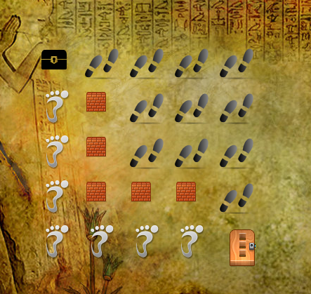

Solve maze using Prolog 
==============

Example
=======





Requirements Unix 
=================

```sh
 $ sudo apt-get install swi-prolog swi-prolog-nox
 $ pip install git+https://github.com/blob8108/pyswip
```

Usage
=====

Change the matrix  [maze-conf](maze-conf) and run the file calle launcher.py  

Developer
=========

* Name : Daniel Santos
* Email : dfsantosbu@unal.edu.co
* Github : [XDanielsb](https://github.com/xdanielsb)


### License
This project is licensed under the GPL V3 License - see the [LICENSE](LICENSE) file for details
